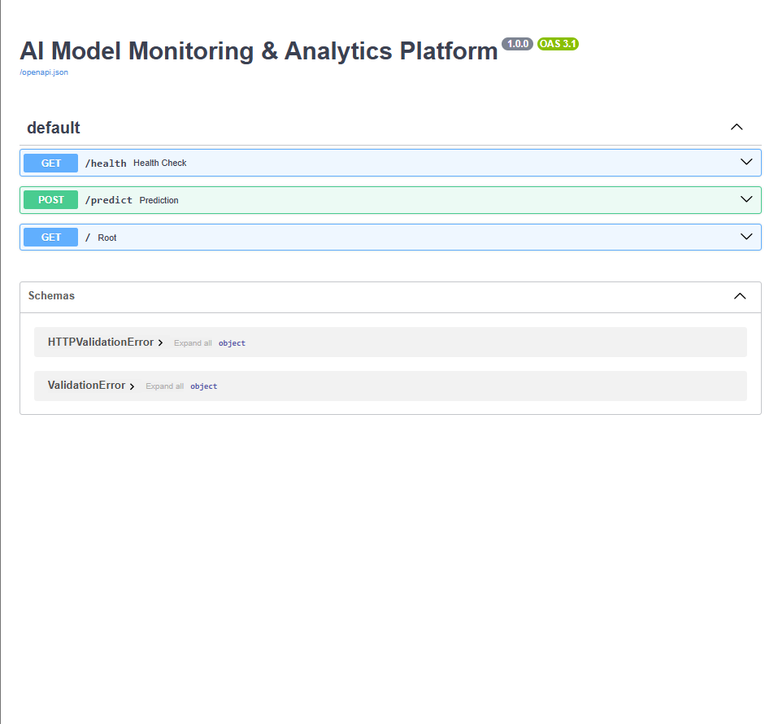
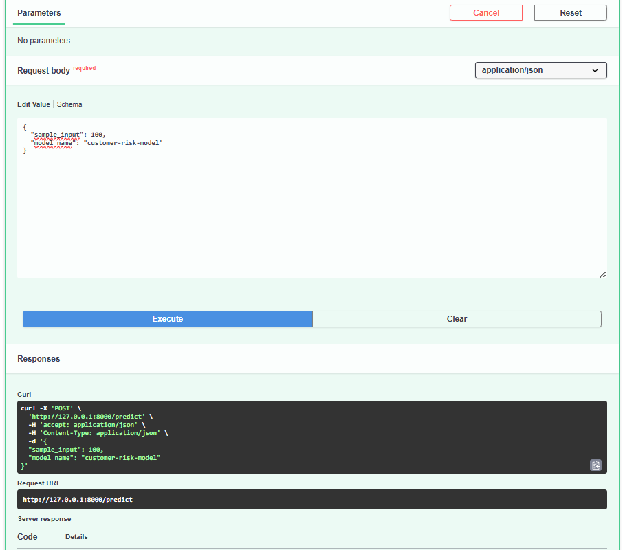
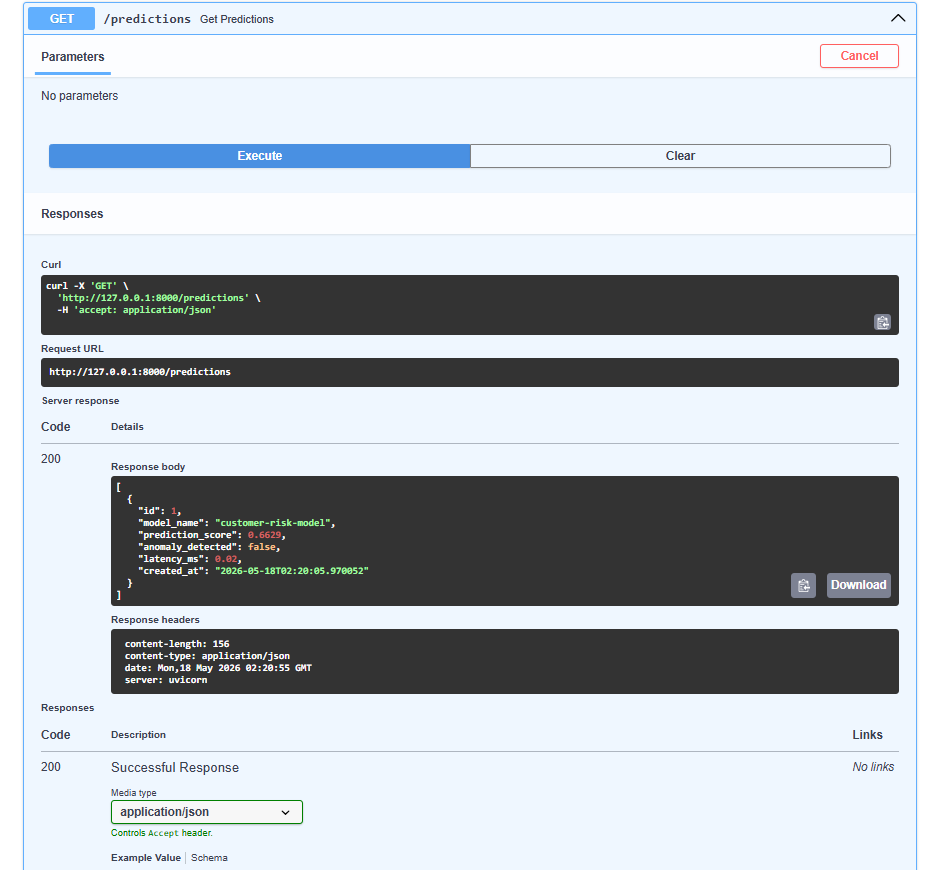
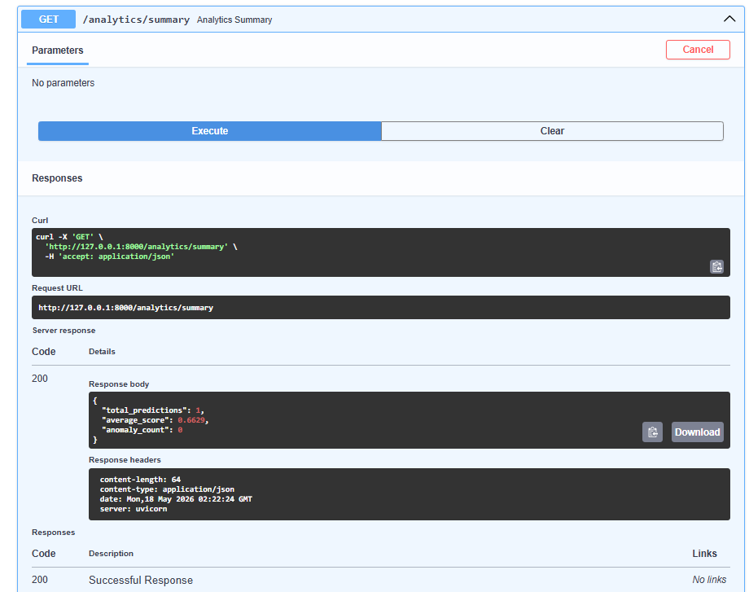
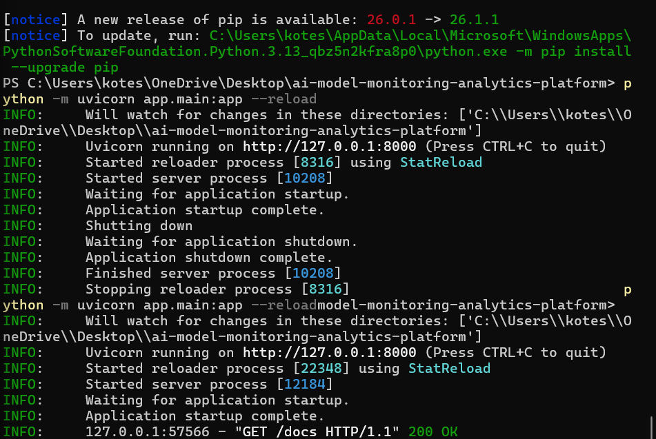
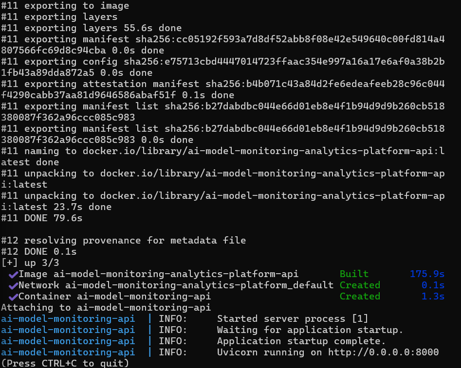
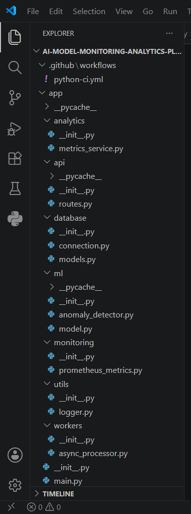

# AI Model Monitoring & Analytics Platform


# AI Model Monitoring & Analytics Platform

Scalable AI-powered monitoring and analytics platform built with FastAPI, TensorFlow, PostgreSQL, Docker, and monitoring services supporting real-time prediction APIs, anomaly detection workflows, analytics dashboards, asynchronous processing, and production-style ML monitoring infrastructure.

---

# Features

- Real-time ML prediction APIs using FastAPI
- AI model monitoring workflows
- Prediction analytics and reporting
- Anomaly detection engine
- PostgreSQL prediction logging
- Prometheus metrics integration
- Async processing architecture
- Dockerized deployment
- CI/CD automation using GitHub Actions
- Structured backend service architecture
- Production-style REST API workflows
- Monitoring and observability support
- Prediction history tracking
- Backend logging system
- API health monitoring

---

# Tech Stack

## Backend
- FastAPI
- Python
- Uvicorn

## Machine Learning
- TensorFlow
- NumPy
- Scikit-learn

## Database
- PostgreSQL
- SQLAlchemy

## Monitoring & Analytics
- Prometheus
- Custom analytics services

## DevOps
- Docker
- Docker Compose
- GitHub Actions

---

# Project Structure

```bash
ai-model-monitoring-analytics-platform/
│
├── .github/workflows/
│   └── python-ci.yml
│
├── app/
│   ├── analytics/
│   │   └── metrics_service.py
│   │
│   ├── api/
│   │   └── routes.py
│   │
│   ├── database/
│   │   ├── connection.py
│   │   └── models.py
│   │
│   ├── ml/
│   │   ├── model.py
│   │   └── anomaly_detector.py
│   │
│   ├── monitoring/
│   │   └── prometheus_metrics.py
│   │
│   ├── workers/
│   │   └── async_processor.py
│   │
│   ├── utils/
│   │   └── logger.py
│   │
│   └── main.py
│
├── tests/
│   └── test_health.py
│
├── Screenshots/
│
├── docker-compose.yml
├── Dockerfile
├── requirements.txt
└── README.md
```

---

# API Endpoints

| Method | Endpoint | Description |
|--------|----------|-------------|
| GET | `/health` | Service health monitoring |
| POST | `/predict` | Real-time ML prediction |
| GET | `/predictions` | Retrieve prediction history |
| GET | `/analytics/summary` | Prediction analytics summary |
| GET | `/` | Root endpoint |

---

# Run Locally

## Clone Repository

```bash
git clone https://github.com/koteshbabubommana/ai-model-monitoring-analytics-platform.git
```

## Move Into Project

```bash
cd ai-model-monitoring-analytics-platform
```

## Install Dependencies

```bash
pip install -r requirements.txt
```

## Start FastAPI Server

```bash
python -m uvicorn app.main:app --reload
```

Server runs at:

```bash
http://127.0.0.1:8000
```

Swagger API Documentation:

```bash
http://127.0.0.1:8000/docs
```

---

# Docker Deployment

## Build and Run Container

```bash
docker-compose up --build
```

---

# Sample Prediction Request

```json
{
  "sample_input": 100,
  "model_name": "customer-risk-model"
}
```

---

# Sample Prediction Response

```json
{
  "request_id": 1,
  "prediction": {
    "model_prediction_score": 0.6562,
    "model_version": "v1.0"
  },
  "anomaly_detected": false,
  "latency_ms": 12.4,
  "stored_in_database": true
}
```

---

# Screenshots

## API Documentation



---

## Prediction API Response



---

## Predictions Monitoring API



---

## Analytics Summary API



---

## Server Running



---

## Docker Deployment



---

## Project Structure



---

# CI/CD Pipeline

GitHub Actions workflow automatically:
- installs dependencies
- runs tests
- validates API workflows
- verifies build success

---

# Future Improvements

- Real TensorFlow model deployment
- Advanced anomaly detection models
- Kafka streaming integration
- Grafana monitoring dashboards
- Batch inference pipelines
- Kubernetes deployment
- Cloud deployment support
- Authentication and authorization
- Real-time alerting system
- Distributed worker orchestration

---

# Author

## Kotesh Babu Bommana

- GitHub: https://github.com/koteshbabubommana
- LinkedIn: https://www.linkedin.com/in/kotesh-babu-bommana
